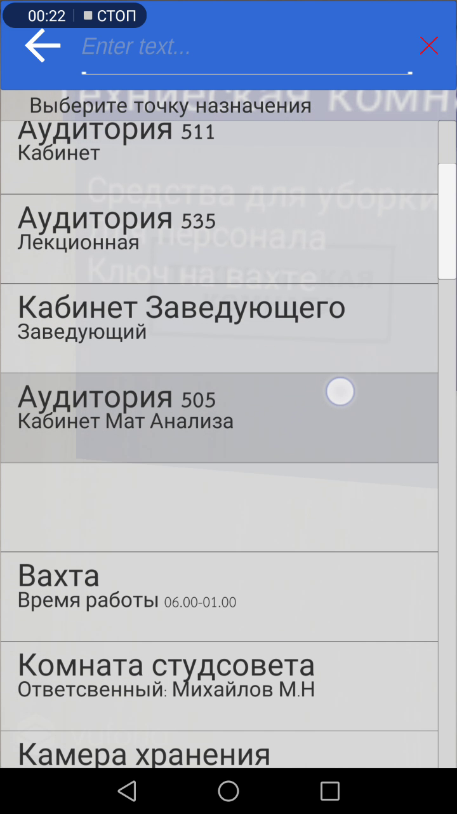
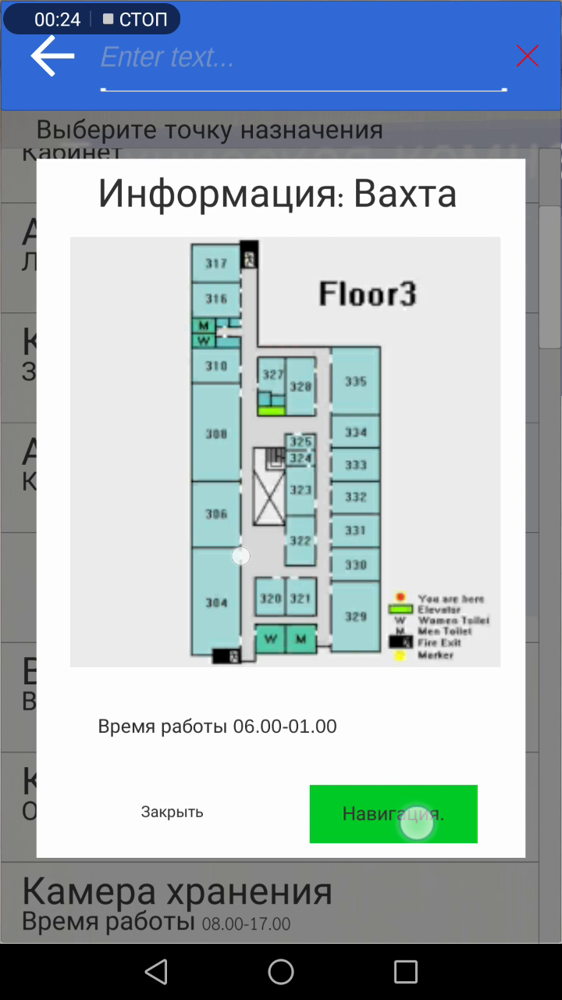
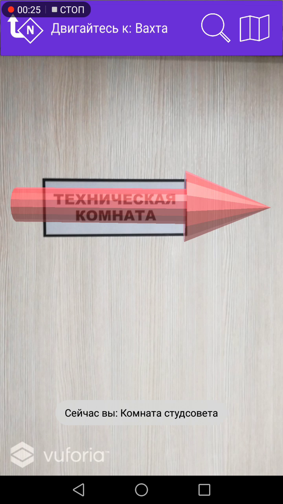
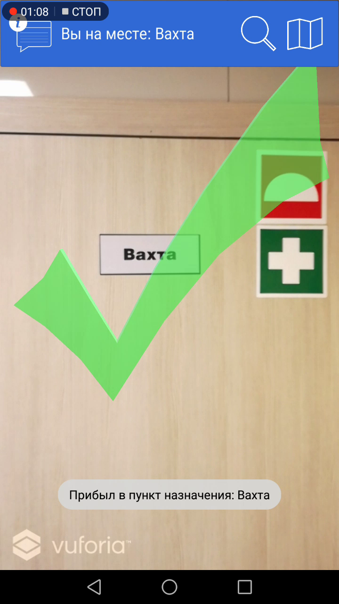

# AR Navigation
Indoor navigation using Unity and Vuforia SDK
This project is in development. | Senior project for Bachelor of Science (Information Technology).
 
## Description Overall
This project are navigation system on android. Point your mobile's camera to building for find marker images taht resamble with image in database. When found, it will show AR that contains data of that position (if not in navigate mode).
User can known thier position and rotation direction from Top-view map. and can start navigate mode by choosing destination of that building from Search page. When in navigation mode and point your camera to marker, It will show AR red arrow point to next node. And will show AR green checked when reach destination.

## Abstract from my paper (may be easier to understand)
– Augmented reality based indoor navigation system running on a smartphone is proposed to be used for in-building navigation. The system uses a built-in camera to capture the image of surroundings, detects a natural marker in the image, and calculates the pose of the camera with respect to the marker. The position and orientation of the camera (which are the same as the smartphone itself) with respect to the indoor map are then determined using the pose information of that marker—note that each marker must be pre-registered with pose information in the system. Once the destination is specified by the user, the shortest path to that destination will be calculated and the arrow pointing along the path to the destination will be augmented on the scene. The information message explaining the route will also be annotated on the screen and be read out to help guide users to the destination. In addition, the system can display a top view map of building showing current position and facing direction of the user, and drawing the route to the destination—the top-view mode makes a better understanding and experience for the user. 

## ScreenShot
On start app and found marker. Marker will show like  

 
Search page   

Before navigate will have dialog of destination's data and navigate button  

 
In navigate mode (purple)  

 
when reached destination  

 

------------------------------------------
